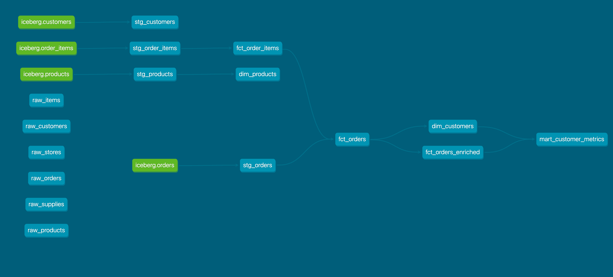

# gcp-iceberg-dbt

End-to-end **GCP lakehouse demo** using **Apache Iceberg**, **BigQuery**, and **dbt**.

This project demonstrates how to build a modern analytics stack on Google Cloud using an open table format (Iceberg) as the storage and versioning layer, BigQuery as the query engine, and dbt for analytics engineering.

---

## Architecture

**Flow**

Local / Scripted Data  
→ GCS (Parquet)  
→ Apache Iceberg (metadata, snapshots)  
→ BigQuery (query engine)  
→ dbt (staging → marts, tests)

**Key ideas**
- Iceberg handles **table format, schema evolution, and time travel**
- BigQuery queries Iceberg tables directly
- dbt builds clean analytical models on top

---

## Repository Structure

```text
gcp-iceberg-dbt/
├── architecture/
│   └── architecture.md        # Lakehouse + Iceberg architecture explanation
├── bigquery/
│   └── sql/
│       ├── 01_external_tables.sql        # External tables over raw Parquet (read-only)
│       └── 02_create_iceberg_tables.sql  # CTAS → create Iceberg tables in GCS
├── iceberg/
│   └── README.md              # Iceberg concepts (metadata, snapshots, engines)
├── dbt/
│   ├── models/
│   │   ├── staging/
│   │   └── marts/
│   └── README.md              # dbt-on-Iceberg notes
├── data/
│   └── generated/             # Generated Parquet data (gitignored, reproducible)
├── scripts/
│   └── bootstrap_repo.sh      # Optional repo setup helpers
├── src/
│   └── generate_commerce_data_soft.py    # Parquet data generator
├── .gitignore
├── requirements.txt
└── README.md


---

## What This Project Shows

- How to organize data in **GCS** for Iceberg
- How to create and manage **Iceberg tables**
- How to query Iceberg tables from **BigQuery**
- How to build **dbt staging and mart models**
- How Iceberg snapshots differ from dbt snapshots
- Reproducible pipelines (no generated data committed)

---

## Prerequisites

- Google Cloud project
- GCS bucket
- BigQuery dataset
- Python 3.9+
- dbt (BigQuery adapter)
- Permissions to create tables and query data

---

## How to Run (High Level)
⚠️ BigQuery processing location must be set to `europe-west3` for all queries.


1. Configure GCP credentials
2. Upload raw data to GCS
3. Create Iceberg tables
4. Query tables from BigQuery
5. Run dbt models

Detailed, step-by-step instructions are provided in each folder.

---

## Why Iceberg + BigQuery + dbt?

- **Open format** (no vendor lock-in)
- **Time travel & schema evolution**
- **Separation of storage and compute**
- **Production-grade analytics workflows**

This mirrors real-world modern data platforms.

---

## Current State (Working)

- Source of truth: Parquet files in GCS (`raw/commerce/*/data`)
- Iceberg tables created in BigQuery:
  - `analytics_iceberg.customers`
  - `analytics_iceberg.orders`
  - `analytics_iceberg.order_items`
  - `analytics_iceberg.products`
- Iceberg storage location:  
  `gs://gcp-iceberg-dbt-iceberg/iceberg/commerce/*`
- Created via BigQuery CTAS using a Cloud Resource connection

---

## Analytics Modeling (dbt)

The analytics layer follows a **fact + dimension** design with a clear separation
between scalable ingestion logic and history-dependent business logic.

### Fact tables
- **fct_order_items**  
  Order-item grain (one row per product per order)

- **fct_orders** *(incremental)*  
  Order-level fact optimized for scale using BigQuery `MERGE`  
  Contains only ingestion-safe fields

- **fct_orders_enriched**  
  Semantic order fact derived from `fct_orders`  
  Computes history-dependent logic such as:
  - `is_first_order`

### Dimension tables
- **dim_customers**  
  One row per customer, built from enriched orders

- **dim_products**  
  One row per product with descriptive attributes

  ### Analytics mart (final)

- **mart_customer_metrics**  
  Customer-level analytics mart built from `fct_orders_enriched` to showcase business-ready KPIs:
  lifetime revenue, recency (days since last order), repeat status, average days between orders, and a simple customer segment.

### Model Lineage

The following lineage graph illustrates the full analytics dependency chain,
from Iceberg-backed sources through staging, facts, dimensions, and the final
analytics mart.



### Design note
History-dependent logic is intentionally isolated from incremental models
to ensure correctness with late-arriving data.

---

## Data Quality & Testing

All marts are covered by dbt tests:
- Primary key uniqueness
- Non-null constraints
- Referential integrity between facts and dimensions

Tests are enforced at build time to guarantee contract stability.

---

## Author

**Ander Martinez-Donate**  
Data Engineer